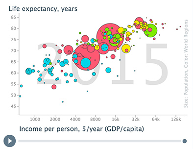

# Background

[Gapminder](https://www.gapminder.org/about-gapminder/) is an independent Swedish foundation with no **political, religious or economic affiliations**. Gapminder is a `fact tank, not a think tank`. Gapminder fights devastating misconceptions about global development. Gapminder produces free teaching resources making the world understandable based on reliable statistics. Gapminder promotes a fact-based worldview everyone can understand.  Gapminder collaborates with universities, UN, public agencies and non-governmental organizations. 

> All Gapminder activities are governed by the board. We do not award grants. Gapminder Foundation is registered at Stockholm County Administration Board.




## Installation

Install `gapminder` from CRAN:

```{r chunk 1, eval = FALSE}
install.packages("gapminder")

```

Or you can install `gapminder` from Github

```{r chunk 2, eval=FALSE}
devtools::install_github("jennybc/gapminder")

```


    ```{r}
p <- gapminder::gapminder %>% ggplot(aes(x = gdpPercap, y = lifeExp, color = continent)) + 
    geom_point()
```
